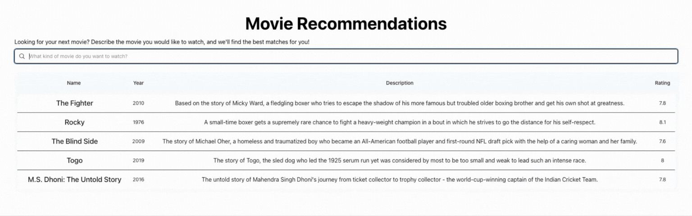
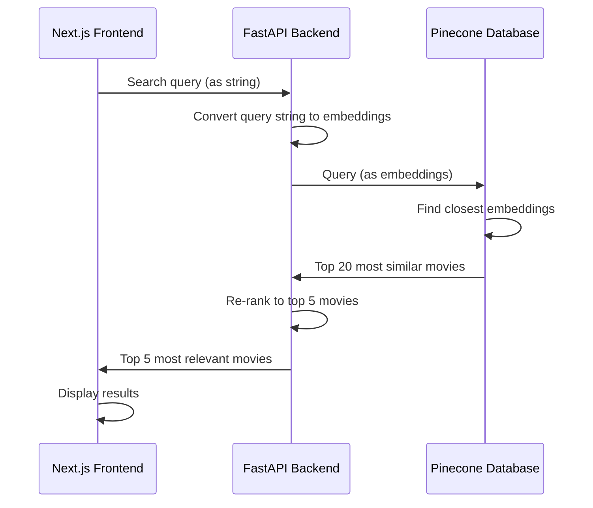

# Most Similar Movies Using Semantic Search
## Summary
This is a semantic search-powered movie recommendation app using Cohere and Pinecone.
Users can describe the kind of movie they want to watch — by mood, genre, theme, or style — and receive intelligent suggestions based on the most similar movies to their search query.

The embeddings of the descriptions for the 1000 movies on IMDb were extracted using the [Cohere Embed API](https://docs.cohere.com/reference/embed) and stored in a [Pinecone](https://docs.pinecone.io/integrations/cohere) database.
Given a new query that the user enters into this web app, the new search is converted to its embeddings and the 20 most similar movie descriptions are returned from a Pinecone database.
The [Cohere Rerank API](https://docs.cohere.com/reference/rerank) then re-ranks the top results and the 5 most relevant movies are displayed to the user in the web app.

### Examples
#### Search for "superheroes who save the city"

#### Search for "underdog story winning big"

#### Search for "royal family"

## How it Works
### Embedding Preprocessing
The plot summaries of the 1000 highest rated movies on [IMDb](https://www.imdb.com/) can be found in the [IMDb Movies Dataset](https://www.kaggle.com/datasets/harshitshankhdhar/imdb-dataset-of-top-1000-movies-and-tv-shows) on Kaggle.
Because we want to find which movie summary is the "closest" or most similar to the movie that the user is looking for, we must first convert each movie summary into its embedding representation so that they can be compared with one another.
Once that is complete, we can save these embeddings to a vector database so that we can easily calculate the vector similarities between each movie and new search terms in the future.

More information can be found in the `preprocess` folder of this repository; please check it out [here](https://github.com/1cookspe/Most-Similar-Movies/tree/main/preprocess).

### Web application
The frontend is a [Next.js](https://nextjs.org/) web app in TypeScript while the backend is a [FastAPI](https://fastapi.tiangolo.com/) service in Python.
A vector database in [Pinecone](https://www.pinecone.io/) is used to store the embeddings of each movie's description, as well as other metadata to display to the user (movie title, year, and rating).

The data flow, from the user's search to the most relevant movies, can be viewed in the chart below.

For more information, please check out the frontend in the `frontend` folder [here](https://github.com/1cookspe/Most-Similar-Movies/tree/main/frontend) and the backend in the `backend` folder [here](https://github.com/1cookspe/Most-Similar-Movies/tree/main/backend).
