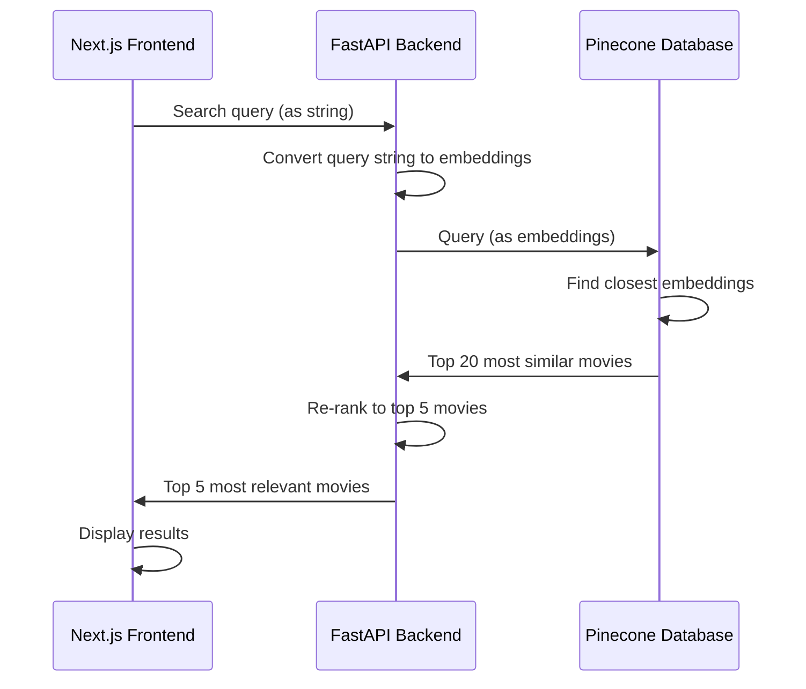

# Movie Recommendations using Semantic Search - Frontend
This is a semantic search-powered movie recommendation app using Cohere and Pinecone.
Users can describe the kind of movie they want to watch — by mood, genre, theme, or style — and receive intelligent suggestions based on the most similar movies to their search query.

The embeddings of the descriptions for the 1000 movies on IMDb were extracted using the [Cohere Embed API](https://docs.cohere.com/reference/embed) and stored in a [Pinecone](https://docs.pinecone.io/integrations/cohere) database.
Given a new query that the user enters into this web app, the new search is converted to its embeddings and the 20 most similar movie descriptions are returned from a Pinecone database.
The [Cohere Rerank API](https://docs.cohere.com/reference/rerank) then re-ranks the top results and the 5 most relevant movies are displayed to the user in the web app.

## How it Works
The frontend is a [Next.js](https://nextjs.org/) web app in TypeScript while the backend is a [FastAPI](https://fastapi.tiangolo.com/) service in Python.
Please note that this repository only contains the Next.js frontend; the FastAPI backend can be found [here](https://github.com/1cookspe/Movie-Recommendations-Backend).

The data flow, from the user's search to the most relevant movies, can be viewed in the chart below.




## Running the App Locally
1. Clone the repository:
```shell
git clone https://github.com/1cookspe/Movie-Recommendations.git
```

```bash
npm run dev
# or
yarn dev
# or
pnpm dev
# or
bun dev
```

Open [http://localhost:3000](http://localhost:3000) with your browser to see the result.
